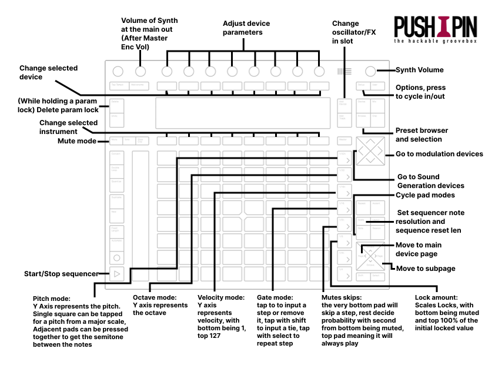

> So I have this running, now what?

### Cheat Sheet

<a href="./cheatsheet.pdf">Printable version</a>

### Sequencing

Press the **NOTE** button to activate the sequencer. The Push 2 "tempo" buttons (directly right of the pads) activate different sequencer modes:

- **1/32t** _Pitch mode:_ Y Axis represents the pitch. Single square can be tapped for a pitch from a major scale, adjacent pads can be pressed together to get the semitone between the notes.
- **1/32** _Octave mode:_ Y axis represents the octave.
- **1/16t** _Velocity mode:_ Y axis represents velocity, with bottom being 1, top 127
- **1/16** _Gate mode:_ tap to to input a step or remove it, tap with **SHIFT** to input a tie, tap with **SELECT** to repeat step
- **1/8t** _Mute skip:_ the very bottom pad will skip a step, the rest decide probability with second from bottom being muted; top pad meaning it will always play.
- **1/8** _Lock amount:_ Scales Locks, with bottom being muted and top 100% of the initial locked value

It's good to start on "Gate mode", add a bunch of steps, and then refine those in pitch mode.

### Routing with Overbridge

    <iframe width="560" height="315" src="https://www.youtube.com/embed/2ezX6MCOlo8?si=CztI3rN82s1jOuJb&controls=0&rel=0&iv_load_policy=3" title="YouTube video player" frameborder="0" allow="accelerometer; autoplay; clipboard-write; encrypted-media; gyroscope; picture-in-picture; web-share" referrerpolicy="strict-origin-when-cross-origin" allowfullscreen></iframe>

## For Developers

To hack on top of Pushpin, it helps to understand what it's doing upon boot because it interacts with several different subsystems.

The Pushpin Linux distribution spawns 8 duplex Pipewire interfaces, each with 16 inputs and outputs. These are loaded on boot using the Pipewire config located in `/home/pushpin/.config/pipewire/pipewire.conf.d/pushpin_groovebox.conf` (which is also a good place to put any bespoke Pipewire changes). Another duplex for controlling instrument volumes is also initialised as `pushpin-volumes`. The `pushpin-n` duplex devices are dynamically connected to using the `audio-in` device in Pushpin and are used to manage track audio inputs, enabling complex routing.

Once the system has booted, it logs into the user `pushpin` (default password: `pushpin`) and runs `/home/pushpin/start_pushpin.sh`, which is ultimately an alias for `/home/pushpin/s/music_devices/pushpin_groovebox/run.sh`. This starts Python running `/home/pushpin/s/music_devices/pushpin_groovebox/app.py`, the main entry point for the codebase.

Pushpin starts by instantiating eight instances of `surge-xt-cli`, the command-line version of the Surge XT softsynth. It waits for these to load and then spawns `overwitch`, an open source Overbridge client, and waits for it to load.

It then disconnects the Surge instances from the default audio device and connects them to `pushpin-volumes`.

Please see app.py for a full sense of what Pushpin initialisation looks like. Also, try running `qpwgraph` in Wayland to see how the connection pathways work (run `wayland-pi` at the command line to load Wayland).
